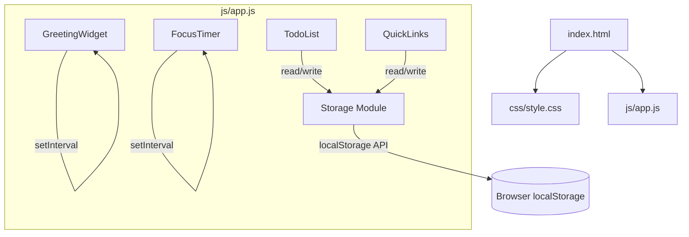
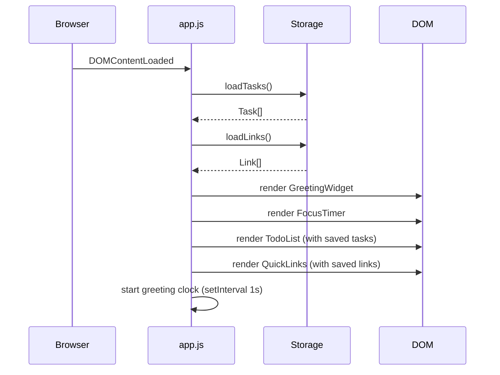

# Design Document: Life Dashboard

## Overview

The Life Dashboard is a client-side single-page application (SPA) built with plain HTML, CSS, and Vanilla JavaScript. It requires no build step, no server, and no external dependencies. The entire application ships as three files: `index.html`, `css/style.css`, and `js/app.js`.

The application is composed of four independent widgets rendered in a responsive grid layout:

1. **Greeting Widget** – live clock, date, and time-based greeting
2. **Focus Timer** – 25-minute Pomodoro countdown with audio notification
3. **To-Do List** – task management with inline editing and Local Storage persistence
4. **Quick Links** – user-defined URL shortcuts with Local Storage persistence

All user data (tasks and links) is stored exclusively in the browser's `localStorage` API. No network requests are made at any point.

---

## Architecture

The application follows a simple **widget-based architecture** with a shared storage module. Each widget is a self-contained unit of HTML markup, CSS styling, and JavaScript logic. Widgets communicate only through the shared storage layer — they do not call each other directly.



### Module Responsibilities

| Module | Responsibility |
|---|---|
| `Storage` | Read/write JSON to `localStorage`; handle parse errors gracefully |
| `GreetingWidget` | Display live time, date, and greeting; update every minute via `setInterval` |
| `FocusTimer` | Manage countdown state; control `setInterval` for ticking; play beep on completion |
| `TodoList` | Render task list; handle add/edit/complete/delete; delegate persistence to `Storage` |
| `QuickLinks` | Render link buttons; handle add/delete; delegate persistence to `Storage` |

### Initialization Flow



---

## Components and Interfaces

### Storage Module

The `Storage` module is a plain object (or set of functions) that encapsulates all `localStorage` interactions.

```js
// Public interface
Storage.saveTasks(tasks: Task[]): void
Storage.loadTasks(): Task[]
Storage.saveLinks(links: Link[]): void
Storage.loadLinks(): Link[]
```

- `saveTasks` / `saveLinks`: serialize the array to JSON and call `localStorage.setItem`.
- `loadTasks` / `loadLinks`: call `localStorage.getItem`, attempt `JSON.parse`, and return an empty array on any failure (missing key, invalid JSON, non-array result).

### GreetingWidget

Reads `new Date()` on each tick and updates three DOM elements:

- `#greeting-time` — formatted as `HH:MM` (zero-padded, 24-hour)
- `#greeting-date` — formatted as `"Weekday, DD Month YYYY"`
- `#greeting-message` — one of: `"Good Morning"`, `"Good Afternoon"`, `"Good Evening"`, `"Good Night"`

A single `setInterval` fires every 1 000 ms to keep the clock live. The greeting message is derived from the local hour using the boundary table:

| Hour range | Message |
|---|---|
| 5 ≤ h < 12 | Good Morning |
| 12 ≤ h < 18 | Good Afternoon |
| 18 ≤ h < 22 | Good Evening |
| h ≥ 22 or h < 5 | Good Night |

### FocusTimer

Internal state:

```js
{
  remaining: number,   // seconds remaining (starts at 1500)
  running: boolean,    // whether the interval is active
  intervalId: number | null
}
```

Public operations triggered by button clicks:

- **Start**: if `!running`, set `running = true`, start `setInterval(tick, 1000)`, disable start button.
- **Stop**: clear interval, set `running = false`, enable start button.
- **Reset**: Stop, set `remaining = 1500`, update display to `"25:00"`.
- **Tick** (internal): decrement `remaining`; if `remaining <= 0`, call `complete()`.
- **Complete** (internal): Stop, display `"Session complete!"`, play beep, enable start button.

The beep is generated using the Web Audio API (`AudioContext`, `OscillatorNode`) — no audio file required.

```js
function playBeep() {
  const ctx = new AudioContext();
  const osc = ctx.createOscillator();
  osc.connect(ctx.destination);
  osc.frequency.value = 880;
  osc.start();
  osc.stop(ctx.currentTime + 0.3);
}
```

### TodoList

Each task is rendered as a `<li>` element containing:
- Task text (or an `<input>` when in edit mode)
- Complete toggle button (checkbox-style)
- Edit button
- Delete button

Operations:

| Operation | Trigger | Behavior |
|---|---|---|
| Add | Submit form | Validate → create Task → append to array → `saveTasks` → re-render |
| Edit (activate) | Click edit btn | Replace text node with `<input>` pre-filled with current text |
| Edit (confirm) | Enter / blur | Validate → update Task → `saveTasks` → re-render |
| Edit (cancel) | Escape key | Restore original text, no save |
| Complete | Click toggle | Flip `completed` flag → `saveTasks` → update styling |
| Delete | Click delete btn | Remove from array → `saveTasks` → remove `<li>` |

Validation rules:
- Empty or whitespace-only → reject, show inline error, clear error on next `input` event.
- Length > 200 chars → reject with inline error.

### QuickLinks

Each link is rendered as a `<button>` (or `<a>`) element with a delete icon overlay.

Operations:

| Operation | Trigger | Behavior |
|---|---|---|
| Add | Submit form | Normalize URL → validate → create Link → `saveLinks` → render button |
| Open | Click button | `window.open(url, '_blank')` |
| Delete | Click delete icon | Remove from array → `saveLinks` → remove button element |

URL normalization: if the URL does not start with `http://` or `https://`, prepend `https://`.

Validation rules:
- Label: non-empty, non-whitespace, ≤ 50 chars.
- URL (after normalization): must start with `http://` or `https://` followed by at least one non-whitespace character; total length ≤ 2 048 chars.

---

## Data Models

All data is stored in `localStorage` as JSON strings. No server-side schema is involved.

### Task

```js
/**
 * @typedef {Object} Task
 * @property {string} id          - Unique identifier (e.g., crypto.randomUUID() or Date.now().toString())
 * @property {string} text        - Task description (1–200 characters, non-whitespace)
 * @property {boolean} completed  - Whether the task has been marked complete
 */
```

Storage key: `"life-dashboard-tasks"`
Storage format: `JSON.stringify(Task[])`

### Link

```js
/**
 * @typedef {Object} Link
 * @property {string} id     - Unique identifier
 * @property {string} label  - Display label (1–50 characters, non-whitespace)
 * @property {string} url    - Fully-qualified URL (starts with http:// or https://, ≤ 2048 chars)
 */
```

Storage key: `"life-dashboard-links"`
Storage format: `JSON.stringify(Link[])`

### Storage Invariants

- Both storage keys always hold either a valid JSON array or are absent (treated as empty array).
- IDs are unique within each list; no two tasks share an `id`, no two links share an `id`.
- `text` is always trimmed before storage; `label` and `url` are always trimmed before storage.

---

## Correctness Properties

*A property is a characteristic or behavior that should hold true across all valid executions of a system — essentially, a formal statement about what the system should do. Properties serve as the bridge between human-readable specifications and machine-verifiable correctness guarantees.*

### Property 1: Task serialization round-trip

*For any* array of Task objects, calling `saveTasks(arr)` followed by `loadTasks()` SHALL return an array with the same length, same order, and identical `id`, `text`, and `completed` field values for every element.

**Validates: Requirements 3.2, 3.10, 5.1, 5.3, 5.5**

---

### Property 2: Link serialization round-trip

*For any* array of Link objects, calling `saveLinks(arr)` followed by `loadLinks()` SHALL return an array with the same length, same order, and identical `id`, `label`, and `url` field values for every element.

**Validates: Requirements 4.2, 4.7, 5.2, 5.3, 5.6**

---

### Property 3: Corrupt or absent storage initializes to empty array

*For any* string value (including `null`, empty string, or arbitrary non-JSON text) stored at `"life-dashboard-tasks"` or `"life-dashboard-links"`, calling `loadTasks()` or `loadLinks()` respectively SHALL return an empty array without throwing an error.

**Validates: Requirements 5.4**

---

### Property 4: Whitespace-only task descriptions are always rejected

*For any* string composed entirely of whitespace characters (spaces, tabs, newlines, or any combination), submitting it as a new task description SHALL leave the task list length unchanged and produce a validation error.

**Validates: Requirements 3.3**

---

### Property 5: Whitespace-only task edits are always rejected

*For any* existing Task and any string composed entirely of whitespace characters, confirming an edit with that string SHALL leave the Task's `text` field unchanged and SHALL NOT write any update to Storage.

**Validates: Requirements 3.6**

---

### Property 6: Task completion toggle is an involution

*For any* Task with any `completed` value, toggling its completion status twice SHALL return the Task to its original `completed` value (i.e., `toggle(toggle(task)).completed === task.completed`).

**Validates: Requirements 3.7**

---

### Property 7: Task deletion reduces list length by exactly one

*For any* non-empty array of Tasks and any valid index into that array, deleting the Task at that index SHALL produce a list whose length is exactly one less than the original, and the deleted Task's `id` SHALL not appear in the resulting list or in Storage.

**Validates: Requirements 3.9**

---

### Property 8: Link deletion reduces list length by exactly one

*For any* non-empty array of Links and any valid index into that array, deleting the Link at that index SHALL produce a list whose length is exactly one less than the original, and the deleted Link's `id` SHALL not appear in the resulting list or in Storage.

**Validates: Requirements 4.6**

---

### Property 9: URL auto-prepend produces a valid https prefix

*For any* non-empty string that does not begin with `http://` or `https://`, calling `normalizeUrl(str)` SHALL return a string that begins with `"https://"` and whose length equals `str.length + 8`.

**Validates: Requirements 4.4**

---

### Property 10: Greeting message covers all hours exhaustively

*For any* integer hour value in the range [0, 23], the `getGreeting(hour)` function SHALL return exactly one of `"Good Morning"`, `"Good Afternoon"`, `"Good Evening"`, or `"Good Night"` — never `null`, `undefined`, or any other value — and the returned value SHALL match the correct boundary for that hour.

**Validates: Requirements 1.4, 1.5, 1.6, 1.7**

---

### Property 11: Time and countdown formatting always produces zero-padded MM:SS / HH:MM

*For any* `Date` object, `formatTime(date)` SHALL return a string matching `/^\d{2}:\d{2}$/`. *For any* integer in [0, 1500], `formatCountdown(seconds)` SHALL return a string matching `/^\d{2}:\d{2}$/`.

**Validates: Requirements 1.1, 1.2, 2.3**

---

## Error Handling

| Scenario | Handling |
|---|---|
| `localStorage` unavailable (private mode, quota exceeded) | Wrap all `localStorage` calls in `try/catch`; log warning to console; app continues in-memory only |
| `JSON.parse` failure on load | Return empty array; do not surface error to user |
| `AudioContext` not supported | Wrap `playBeep` in `try/catch`; timer still completes, beep is silently skipped |
| Task/link submission validation failure | Show inline error message adjacent to the input; clear on next `input` event |
| URL normalization produces oversized URL | Reject with inline validation message after normalization |
| Edit cancelled via Escape | Restore original DOM text; no storage write |

---

## Testing Strategy

### Unit Tests (example-based)

Unit tests cover specific behaviors and edge cases using concrete examples. They are written with plain JavaScript (no framework required, or a lightweight runner like `qunit` / `jest` if desired).

Suggested unit test cases:

- `getGreeting(hour)` returns correct string for each boundary: 0, 4, 5, 11, 12, 17, 18, 21, 22, 23
- `formatTime(date)` returns `"00:00"` for midnight, `"09:05"` for 9:05, `"23:59"` for 23:59
- `formatDate(date)` returns correct weekday, day, month, year string
- `normalizeUrl("")` returns `""` (empty passthrough)
- `normalizeUrl("example.com")` returns `"https://example.com"`
- `normalizeUrl("http://example.com")` returns `"http://example.com"` unchanged
- `validateTask("")` returns error; `validateTask("  ")` returns error; `validateTask("a".repeat(201))` returns error
- `validateLink({ label: "", url: "https://x.com" })` returns error
- `Storage.loadTasks()` returns `[]` when key is absent
- `Storage.loadTasks()` returns `[]` when key holds `"not json"`
- FocusTimer: start → stop → start resumes from paused value (not 25:00)
- FocusTimer: reset always restores to 1500 seconds regardless of current state

### Property-Based Tests

Property-based tests verify universal properties across many generated inputs. Use a PBT library appropriate for the target environment:

- **Browser / Vanilla JS**: [`fast-check`](https://github.com/dubzzz/fast-check) (can be loaded via CDN for test pages)

Each property test MUST run a minimum of **100 iterations**.

Tag format for each test: `Feature: life-dashboard, Property {N}: {property_text}`

#### Property Test Specifications

| Property | Generator | Assertion |
|---|---|---|
| P1: Task round-trip | Arbitrary arrays of `{ id: uuid, text: nonEmptyString(≤200), completed: boolean }` | `loadTasks()` after `saveTasks(arr)` deep-equals `arr` |
| P2: Link round-trip | Arbitrary arrays of `{ id: uuid, label: nonEmptyString(≤50), url: validUrl(≤2048) }` | `loadLinks()` after `saveLinks(arr)` deep-equals `arr` |
| P3: Corrupt storage → empty array | Arbitrary strings that are not valid JSON arrays (including `null`, numbers, malformed JSON) | `loadTasks()` returns `[]`; `loadLinks()` returns `[]` |
| P4: Whitespace task rejected | Arbitrary strings matching `/^\s*$/` | `addTask(str)` returns error; task list length unchanged |
| P5: Whitespace edit rejected | Arbitrary existing Task + arbitrary whitespace string | `confirmEdit(task, str)` returns error; task text unchanged |
| P6: Toggle involution | Arbitrary Task with any `completed` value | `toggle(toggle(task)).completed === task.completed` |
| P7: Task deletion shrinks list by 1 | Arbitrary non-empty Task array + valid index | list length decreases by 1; deleted task id absent from result and storage |
| P8: Link deletion shrinks list by 1 | Arbitrary non-empty Link array + valid index | list length decreases by 1; deleted link id absent from result and storage |
| P9: URL prepend | Arbitrary non-empty strings not starting with `http://` or `https://` | result starts with `"https://"` and `result.length === input.length + 8` |
| P10: Greeting covers all hours | Arbitrary integer in [0, 23] | result is one of the four valid greeting strings and matches correct boundary |
| P11: Time/countdown format | Arbitrary `Date` objects; arbitrary integer in [0, 1500] | `formatTime(date)` matches `/^\d{2}:\d{2}$/`; `formatCountdown(n)` matches `/^\d{2}:\d{2}$/` |

### Integration / Smoke Tests

- Open `index.html` in each target browser; verify all four widgets render without console errors.
- Add a task, refresh the page, verify the task is still present.
- Add a link, refresh the page, verify the link button is still present.
- Set timer to a low value (edit JS constant temporarily), let it expire, verify beep plays and "Session complete!" appears.
- Verify `localStorage` keys `"life-dashboard-tasks"` and `"life-dashboard-links"` are written correctly using browser DevTools.
